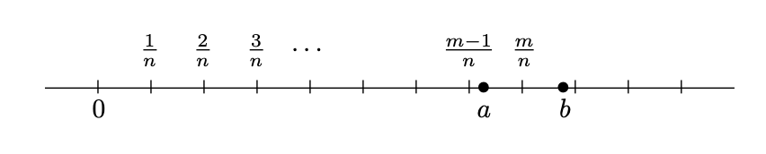

### Consequences of completeness

#### 4-1. Nested Interval Property

The statement looks similar to Example 1.2.2. My first thought was that it's going to be empty.. I guess the difference is that $I_n = [a_n,b_n]$ instead of $\{n,n+1,...\}$ (one, contingent on $a_n$ rather than $n$; two, has an upperbound of $b_n$).

Intuitively, the theorem follows from the fact that all $a_n$ is bounded by all $b_n$, thus by axiom of completeness, there's an $x$ nested for all intervals $[a_n,b_n]$.

#### 4-2. Archimedean Property

Intuitively, property 1 saying that  $\mathbf{N}$ is not bounded above. It is interesting to note that the proof only depends on axiom of completeness and that $\mathbf{N}$ is closed under addition.

Not too sure what's the usefulness of property 2... it's just a reciprocal.. but it's saying that any positive real number is bigger than $1/n$ if $n$ is big enough.

#### 4-3. Density of Q in R

My god... Abbott is so good at explaining this proof. I have never seen any other authors explained the way he does.

I think the tricky part is just choosing m greater than na, such that m is small enough so that 

$$
m-1 \leq na <m
$$

How do we know such m exists? My first thought is that the key is actually to pick $n$ big enough so that it "step over" $(a,b)$. Such $n$ exists by property 2 of Archimedean property (ah, now i see why it's useful). As a result, $1/n$, scaled by some integer $m$, will straddle between $a$ and $a+1$ (see figure). Meaning $m/n$.. wait this does not follow (i iniatially thought of saying $m/n -1$ is less than $a$, but no, it is $m/n - 1/n$)

Ok i just looked at [MO](https://math.stackexchange.com/questions/103839/proof-that-mathbbq-is-dense-in-mathbbr). To prove existence of $m$, given any real $r$,

1. if $r>0$, then $\exists m$, where $m$ is natural number and $m>r$. Let $M$ be the set of such m's. By well-ordering, there is a $m_0 \leq m$. If $m_0=1$, then $0<r<1$ and we are done. If $m_0>1$ then $m_0-1 \leq r$ by well-ordering principle.
2. If $r=0$, then $m_0 =1$ and we are done.
3. If $r <0$, then let $w = -r$. By (1), there is $m_0-1 \leq w <m_0$, therefore $-m_0<r \leq 1-m_0$. If $r < 1-m_0$, we are done. Otherwise, choose $2 - m_0$ and we are done.

#### 4-4. Density of irrational in R

Bro this is cool. I'm shook. Will go to blog post.

#### 4-5. Existence of square roots

I  suppose proof by construction has always been what Im weak at, and this theorem requires proof by constructions.

Essentially, the proof relies on finding a counterexample -- namely, a number whose square is bigger than $a^2$ but smaller than 2. To do that, need to use $(a + 1/n)^{2}$ and pick and $n$ that makes the terms less than 2.

On the other side is finding a number whose square is smaller than $a^2$ but bigger than 2. Again, key is to use $(a - 1/n)^{2}$ and to use $n$ that will make the term bigger than 2.
