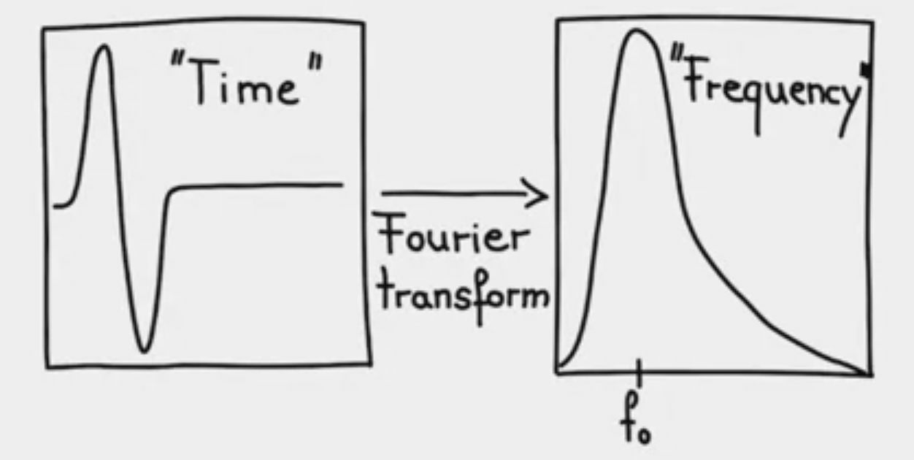
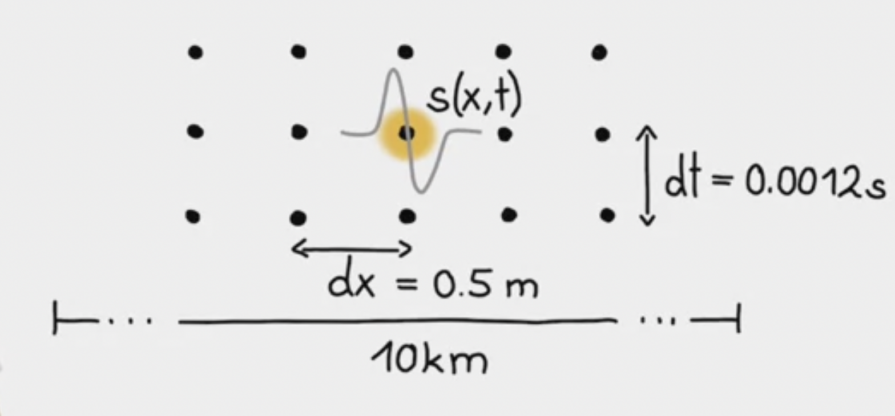
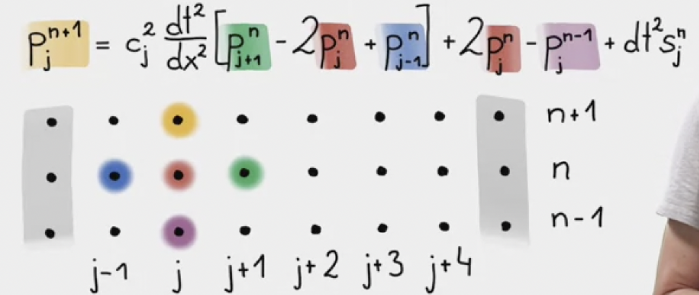
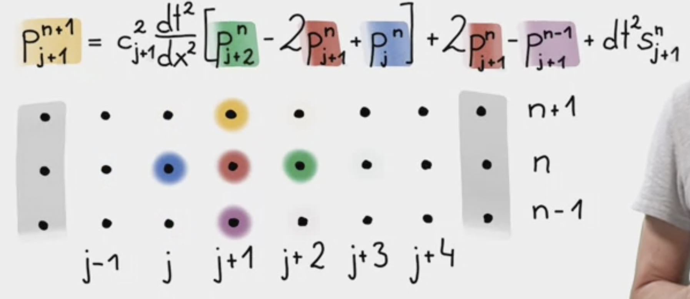
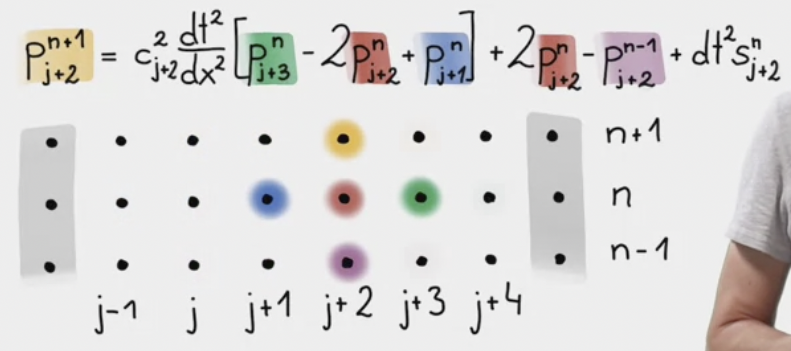
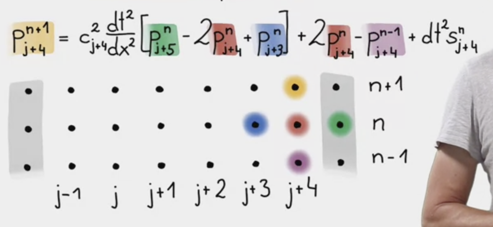

#### 3-1. Wave Equation

Acoustic/scalar wave equation
$$\partial^{2}_{t} p = c^{2} \Delta p +s$$

where $p$ is pressure, $\Delta$ is the Laplacian operator, containing second derivatives in space namely $\partial^{2}_{x} p + \partial^{2}_{y} p  + \partial^{2}_{z} p$, $c$ is the propagation velocity, and $s$ is the source term.

$p$ is a function of space $x$ and time $t$. $c$ is space-dependant but does not depend on time. $s$ depends on both space and time. 

This represents for instance propagation of sound waves. 

#### 3-2. Algorithm

<ins>Space-time discretization</ins>

Space is discretized horizontally by dots. Distance between dots is $dx$. Index each dot by $j$. 

Modify continuous $x$ to be $x_{j} = jdx, j = [0,j_{max}]$.

Time is discretized vertically the same way. Distance between dots is $dt$. Access time with $\cdots, n-1,  n, n+1, \cdots$. 

$t_n = ndt, n = [0, n_{max}]$.

<ins>Consequence for fields</ins>

Move from continuous form $p(x,t)$ to discrete form $p_{j}^{n}$

$p(x_{j}, t_{n} + dt) \rightarrow p_{j}^{n+1}$.

<ins> Finite difference for wave equation </ins>

Wave equation on 1D:
$$\partial^{2}_{t} p(x,t) = c^{2}(x) \partial^{2}_{x} p(x,t) +s(x,t)$$

$\partial^{2}_{t} p(x,t) \rightarrow \dfrac{p_{j}^{n+1} - 2p_{j}^{n} + p_{j}^{n-1}}{dt^{2}}$

$\partial^{2}_{x} p(x,t) \rightarrow \dfrac{p_{j+1}^{n} - 2p_{j}^{n} + p_{j-1}^{n}}{dx^{2}}$

$\implies \dfrac{p_{j}^{n+1} - 2p_{j}^{n} + p_{j}^{n-1}}{dt^{2}} = c^2 \dfrac{p_{j+1}^{n} - 2p_{j}^{n} + p_{j-1}^{n}}{dx^{2}} + s_{j}^{n}$

$\implies$ $p$ at point $j$ is defined at 3 different times, $n+1,n,n-1$

$\implies$ <ins>Extrapolation problem</ins>. Isolate $p$ at $j$ for $n+1$ (future), and put everything else on the right hand side

$\implies$ $p_{j}^{n+1} = c_{j}^{2} \frac{dt^{2}}{dx^{2}}[p_{j+1}^{n} - 2p_{j}^{n} + p_{j-1}^{n}] + 2p_{j}^{n} - p_{j}^{n-1} + dt^{2}s_{j}^{n}$, which is called <ins>fully explicit scheme</ins> because we can write the future based on what we know in the present and the past. 

#### 3-3. Boundaries, Sources 

<ins> Boundary conditions </ins>

Set the pressure to zero at the edges. Reflects a perfectly reflecting boundary -- energy that goes to the sides will come back in.

$p(x = 0,t) = 0$

$p(x = x_{max},t)=0$

<ins> Initial conditions </ins>

$p(x, t = 0) = 0$

$\partial_{t}p(x, t=0) = 0$

<ins> Source terms </ins>

If we solve pde, often make use of delta functions
$$\begin{equation}
  \delta(x)=\begin{cases}
    \infty, & \text{at $x=0$}.\\
    0, & \text{otherwise}.
  \end{cases}
\end{equation}$$

The integral is equal to one

$$ \int_{\infty}^{\infty} \delta(x)dx =1$$

Compare our numerical solution with that of analytic, using Green's function.

<ins> Box $\delta$-generating function (space) </ins>

$$\begin{equation}
  \delta_{bc}(x)=\begin{cases}
    \frac{1}{dx}, & \text{for $x \leq\frac{dx}{2}$}.\\
    0, & \text{otherwise}.
  \end{cases}
\end{equation}$$

As $dx \rightarrow 0$, this function converges to the delta function.

<ins> Gaussian $\delta$-generating function (time) </ins>

$$\delta_{a}(t) = \dfrac{1}{\sqrt{2\pi a}}e^{-t^{2}/2a}$$

As $a \rightarrow 0$, this function converges to the delta function

$\implies$ finite approximation have the properties of integral equal to one

$$\int_{-\infty}^{+\infty} \delta_{bc} (x) dx = 1$$

$$\int_{-\infty}^{+\infty} \delta_{a} (x) dx = 1$$

<ins>Dirac delta function $\delta(x)$ </ins>

$$\int_{-\infty}^{\infty} f(x) \delta(x-a) = f(a)$$

Using discrete version of the Dirac delta function allows us to numerically approximate Green's function, and compare with analytical solutions.

<ins>Source-time function</ins>

We can denote the grid point, along space, to be $j_s$ to indicate the source that corresponds to where discrete version of delta function is injected. (the point where we introduce the source term)

In the beginning everything is at rest, and then progressively during the simulation, we will start injecting energy at this particular point.

$s(x,t) = \delta(x-x_{s})f(t)$

Often use first derivative of Gaussian function:

$f(t) = -8f_{0}(t-t_{0})e^{-\frac{1}{4f_{0}^{2}}(t-t_{0})^{2}}$. Think has an error. Should be $f(t) = -8f_{0}(t-t_{0})e^{-(4f_{0})^{2}(t-t_{0})^{2}}$

where $f_0$ is the dominat frequency -- often used for a wave simulation. 

What is dominant frequency? E.g. in spectral space, taking the fourier transform, obtain the amplitude spectrum of that function. It containes a lot of frequencies, but the dominant energy is at frequency $f_0$. 

Why use the first derivative of a Gaussian function to initialize the source-time function if we want a Gaussian waveform as solution to the 1D wave equation?
> The resulting signal is an integral of the source time function. 

#### 3-4. Initialization

Setting up the space-time discretization.

Key questions are:
+ what are the spatial wavelengths?
    + always make use of the relation between velocity, wave number and wavelength
    + $c = \omega/k = \lambda/T$, where $\omega$ is the temporal frequency, $k$ is wavenumber, $\lambda$ is the wavelength, and $T$ the period. 

<ins> A physical problem </ins>

$c = \lambda/T = \lambda f$

$c = 343$ m/s

$f_{1} = 20$ Hz $\rightarrow \lambda_{1} = 17m$ 

$f_{2} = 50$ Hz $\rightarrow \lambda_{2} = 7m$ 

Number of points per wavelength: Discretize the smallest spatial wavelength in the field i.e., 50Hz, 7m. 

$\implies$ smallest spatial wavelength

$\implies$ appropriately sampled.

Similarly, appropriate sampling in time.

Let $dx = 0.5m$ and $dt = 0.0012s$.

Spatial domain of 10km, and inject a source-time function with shape of the first derivative of a Gaussian function. 

<ins> Python </ins>

Recap finite-difference approximation of the 1D wave equation:

$\implies$ $p_{j}^{n+1} = c_{j}^{2} \frac{dt^{2}}{dx^{2}}[p_{j+1}^{n} - 2p_{j}^{n} + p_{j-1}^{n}] + 2p_{j}^{n} - p_{j}^{n-1} + dt^{2}s_{j}^{n}$

Graphically, we start at the second point because we dont calculate points at the boundaries.

Then we sequentially move to $j+4$.

